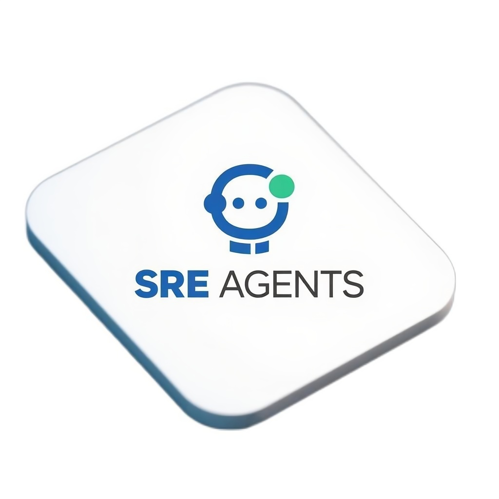

<p align="center">
    
</p>

<p align="center">
    <h1 align="center">SRE Agent for ECS</h1>
</p>

<p align="center">
    <a href="https://github.com/sre-agents/sre-agents-ecs/blob/main/LICENSE">
        
    </a>
</p>

✨ **SRE Agent for ECS** is an agent skilled in ECS operations.

This agent is able to make the experiences of ECS Ops faster 🚀, stabler ⚖️, and easier ✔️.

# Introduction

With the complexity of cloud services increasingly increasing, the traditional way of operations has become increasingly inefficient, slow, and dependent on human experience. Especially in the background of cloud native, microservices, and containerization, the dynamicity and distributed characteristics of system architectures have made the problem of operations more acute.

Under this background, the SRE Agent (SRE Agent) for ECS operations was born. It combines context awareness, knowledge bases, and intelligent tool calls, aiming to automate and improve the stability and efficiency of the SRE operations on ECS.

This project realizes SRE agent for ECS in two modes:

1. **Workflow mode:** Hard coding the workflow of the agent, the output of the previous agent is the input of the current agent.

2. **Agent (LLM orchestration) mode:** Using the LLM to orchestrate the agents, the coder does not need to code the workflow of the agent. The LLM-based orchestrator can understand the user task and choose right sub agent.

## Setup

Prepare the environment and install the dependencies:

```shell
# create conda environment
conda create -n sreagent python=3.10 -y
conda activate sreagent

# install deps
pip install -r requirements.txt
```

Then, config the environment variables by copying the `.env.example` file to `.env`, and fill the values such as `MODEL_API_KEY`. Furthermore:

- To experience the knowledgebase and long-term memory services, the `opensearch`-related and `embedding`-related variables need to be filled
- To experience the ECS operation service, the `ECS_MCP_SERVER` variable need to be filled

## Agent Creation

```python
def create_agent(
    name: str,
    description: str,
    system_prompt: str,
    mcp_servers: list = [],
    tools: list = [],
):
    agent = Agent(
        name=name,
        description=description,
        system_prompt=system_prompt,
        mcp_servers=mcp_servers,
        tools=tools,
        # model: str = LLM,
        # api_key: str = API_KEY,
        # api_base: str = API_BASE_URL,
        # short_term_memory=None, # session context
        # long_term_memory=None, #corss session, personal profile
        # knowledgebase=None, 
        # user_prompt_template: str = "{prompt}",
        # sub_agents: list = [],
        # input_schema=None,
        # output_schema=None,
        # enable_sampling: bool = False, #logging message to generate test dataset
    )
    return agent
```

## Running

**Workflow mode:**

Command:

```shell
PYTHONPATH=. python sre_example/entrypoint.py --mode workflow --prompt "Delete all files with the suffix abc in the i-ydwy7i9xj4bwxxxxxxxx instance in the cn-beijing region"
```

See [preview](assets/images/run_workflow_mode.png) of this mode.

**Agent (LLM orchestration) mode:**

Command:

```shell
PYTHONPATH=. python sre_example/entrypoint.py --mode llm --prompt "Delete all files with the suffix abc in the i-ydwy7i9xj4bwxxxxxxxx instance in the cn-beijing region"
```

See [preview](assets/images/run_llm_mode.png) of this mode.

## Evaluation

> Before starting evaluation, you should set the evaluation-related fields in your `.env` file or environment variables. 

In this project, we use [deepeval](https://github.com/confident-ai/deepeval/) to test the performance of the agent. We test the following agents:

**Command generator**：

We test the quality of the actual outputs of this agent by LLM-as-a-judge. Start test by:

```shell
PYTHONPATH=. deepeval test run tests/test_cmd_generator.py
```

**Risk checker：**

We use assertions to verify whether the agent's actual output matches the expected output. Start test by:

```shell
PYTHONPATH=. pytest tests/test_risk_checker.py
```

**Command executor：**

We examine the tool call situation (e.g., whether a tool is called correctly) by comparing the actual tool call list and expected tool call list. Start test by:

```shell
PYTHONPATH=. deepeval test run tests/test_cmd_executor.py
```

## License

This project is licensed under the [MIT License](https://github.com/sre-agents/sre-agents-ecs/blob/main/LICENSE).
